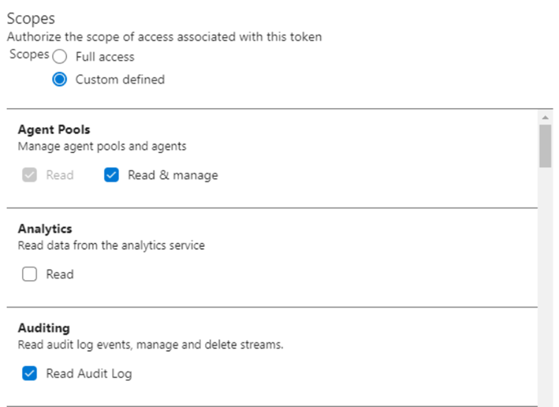

# Self-Hosted-Docker-Agent repository
## Description
This repository is part of a demonstration of how to create a self-hosted Azure Dev Ops agent using Docker and Azure to run that agent.

## Introducction
To build your code or deploy your software using Azure Pipelines, you need at least one agent. An agent is computing infrastructure with installed agent software that runs one job at a time.

## Advantages of using a self-hosted agent
Self-hosted agents give you more control to install dependent software needed for your builds and deployments. Also, machine-level caches and configuration persist from run to run, which can boost speed.

In addition, if you want to run tests in a secure environment where you have a private network, it is useful to have a self-hosted agent because you can give it permissions or add it to a virtual network that allows access to the environment.

## Guide to create an self-hosted agent with docker

### 1. Create an personal access token
You need a personal Access token with read and manage permissions for the agent pools and read permissions for the audit log.
This Personal Access Token will be used in the dockerfile to specify the token as an environment variable.



```
ENV AZP_TOKEN={your_personal_access_token}
```


### 2. Configure DockerFile
It is necessary to modify the environment variables in the dockerfile of the repository:

```
ENV AZP_URL=https://dev.azure.com/{replace_by_your_organization}
ENV AZP_TOKEN={your_personal_access_token}
ENV AZP_AGENT_NAME={name_wanted_as_your_dockeragentname}
```

### 3. Build and run the image in local environment
After setting the configurations you should be able to build and run the docker image in local environment.

```
docker build --tag dockeragent:latest  .
docker run dockeragent:latest
```


### 4. Deploy image in Azure Container Registry 
To run the container in the cloud we must publish the image in a docker registry. Azure allows the publication of docker images in Azure Container Registry.
To do this, we must first create an Azure Container Registry, in my case "azurecontainerinstancesample" and then upload such image using tag and push
You may be required to log in to the azure account registry first. You should use this command with the Access keys in the container registry:


```
az acr login --name {acr_name} --username {AccessKey_username} --password {AccessKey_Password}
docker tag dockeragent:latest azurecontainerinstancesample.azurecr.io/dockeragent:latest
docker push azurecontainerinstancesample.azurecr.io/dockeragent:latest
```

### 5. Use image in the container Registry to create an Azure Container Instance
Now you can create an instance of the image in a container so that we have the agent running in the cloud. To do this we can use the portal or we can use the following command:

```
az container create --resource-group {resourcegroup} --name {container_name} --image azurecontainerinstancesample.azurecr.io/dockeragent:latest --os-type Linux --cpu 1 --memory 1.5 --restart-policy OnFailure
```


### 6. CICD of the repository in azure-pipelines
To automate the process of all the above we can use CICD of azure pipelines indicating that when a change occurs in the main branch a task is responsible for doing build and push in the containerRegistry and the indicated repository of azure-pipelines.yml.

```
trigger:
- main

pool:
  vmImage: ubuntu-latest

steps:
- task: Docker@2
  inputs:
    containerRegistry: 'azurecontainerinstancesample'
    repository: 'dockeragent'
    command: 'buildAndPush'
    Dockerfile: '**/Dockerfile'
```

## How to use the new agent in other pipelines
### Configure build pipelines to use the new agent
You must configure the pipelines that wants to use the new agent changing in the pool part of the yml file the name of the pool (azure-pipelines.yml)

```
pool:
      name: Default
      demands:
        - Agent.Name -equals dockeragent #Optional
```

### Configure release pipelines to use the new agent
To select the agent we want to use in the release pipelines we must use the option provided by the release pipelines:

